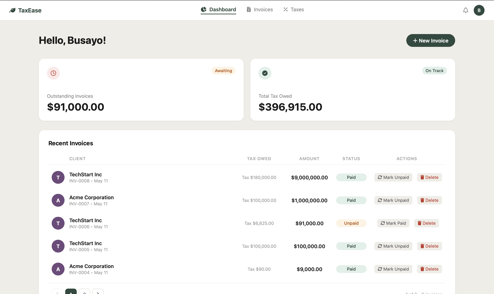

# TaxEase — Mini Tax & Invoice Dashboard

A lightweight full-stack application for managing clients and calculating tax on invoices. Built as part of the Oakwood engineering assessment.

---



---

## Tech Stack

| Layer | Technology |
|---|---|
| Backend | Node.js, Express, TypeScript |
| Database | SQLite3 via Knex.js (migrations + seeds) |
| Frontend | Vanilla HTML, CSS, JavaScript |


---

## Getting Started

### Prerequisites

- Node.js v18+
- npm

---

### 1. Clone the repository

```bash
git clone <your-repo-url>
cd Oakwood-Benchmark-Test
```

---

### 2. Install dependencies

```bash
cd backend
npm install
```

---

### 3. Configure environment

```bash
cp .env.example .env
```

The default `.env` values work out of the box — no changes needed:

```
NODE_ENV=development
PORT=3001
DATABASE_PATH=./data/invoices.db
```

---

### 4. Initialise the database

Run migrations to create the `clients` and `invoices` tables:

```bash
npm run db:migrate
```

---

### 5. Seed demo clients

Inserts two demo clients (Acme Corporation, TechStart Inc):

```bash
npm run db:seed
```

> **One-command setup** — steps 2–5 can be run together:
> ```bash
> npm run setup
> ```

---

### 6. Start the backend

```bash
npm run dev
```

Server starts at **http://localhost:3001**

---

### 7. Open the frontend

Open `frontend/index.html` directly in your browser — no build step required.

---

## API Endpoints

| Method | Endpoint | Description |
|---|---|---|
| `GET` | `/api/clients` | Returns all clients |
| `POST` | `/api/invoices` | Creates a new invoice |
| `GET` | `/api/invoices/summary` | Returns invoices joined with client name + calculated `tax_owed` |
| `PATCH` | `/api/invoices/:id/status` | Marks an invoice as Paid or Unpaid |
| `DELETE` | `/api/invoices/:id` | Deletes an invoice |

### POST /api/invoices — Request Body

```json
{
  "client_id": 1,
  "amount": 5000,
  "tax_rate": 15
}
```

### GET /api/invoices/summary — Response

```json
[
  {
    "id": 1,
    "client_name": "Acme Corporation",
    "amount": 5000,
    "tax_rate": 15,
    "tax_owed": 750,
    "status": "Unpaid",
    "created_at": "2025-01-15T10:00:00Z"
  }
]
```

---

## Features

- Invoice summary table with client name, amount, tax owed, and status
- Create new invoice via modal form (client dropdown, amount, tax rate)
- Dynamic table updates — no page reload on submission
- Mark invoices as Paid / Unpaid
- Delete invoices with confirmation dialog
- Summary stat cards — Outstanding Invoices (Unpaid only) and Total Tax Owed
- Paginated invoice list (5 per page)
- Backend validation — rejects negative amounts, invalid tax rates, unknown clients
- Auto-seed script — app works out of the box with 2 demo clients

---

## Available Scripts

From the `backend/` directory:

| Script | Description |
|---|---|
| `npm run setup` | Install deps + migrate + seed (first-time setup) |
| `npm run dev` | Start dev server with hot reload |
| `npm run db:migrate` | Apply database migrations |
| `npm run db:rollback` | Roll back last migration |
| `npm run db:seed` | Re-seed demo clients |
